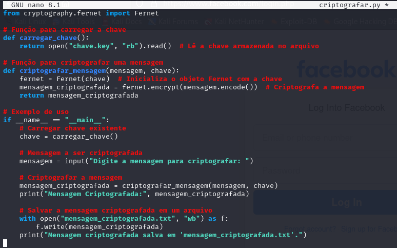
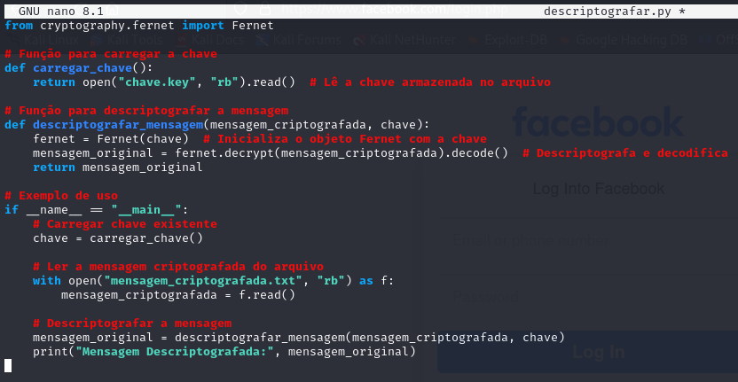
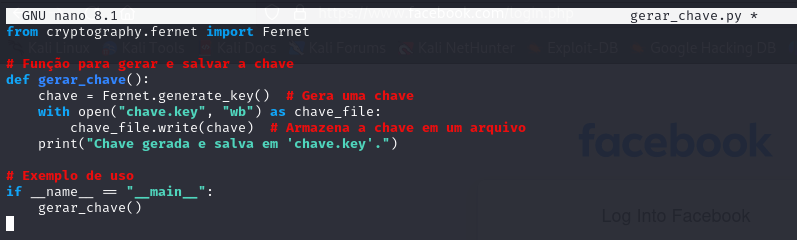
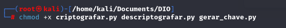
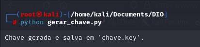
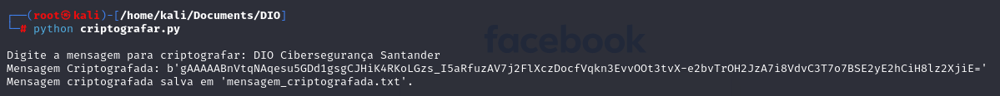
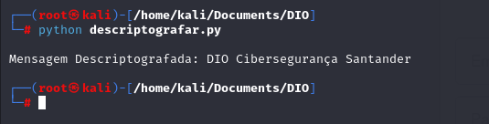

# Ransomware na Prática com Python

Arquivo criptografar.py (para criptografar a mensagem):

Arquivo descriptografar.py (para descriptografar a mensagem):

Arquivo para gerar a chave:

Permissão de execução aos arquivos:

Gerando a chave:

Criptografando a mensagem:

Descriptografando a mensagem:

